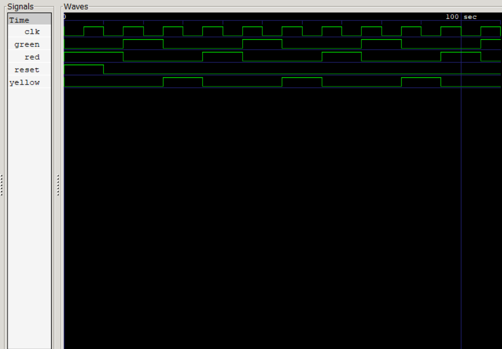

# 🚦 Traffic Light Controller using FSM (Verilog)

## 📌 Description

This project implements a Traffic Light Controller using a Finite State Machine (FSM) in Verilog HDL. The system transitions between Red, Green, and Yellow states based on clock signals.

---

## ⚙️ States

* RED
* GREEN
* YELLOW

---

## 💡 Working

The FSM changes state on each clock cycle:

* RED → GREEN → YELLOW → RED

---

## 🛠️ Tools Used

* Icarus Verilog
* GTKWave

---

## ▶️ How to Run

```bash
iverilog -o traffic src/traffic_light.v tb/traffic_tb.v
vvp traffic
gtkwave traffic.vcd
```

---

## 📷 Waveform Output



---

## 📁 Project Structure

* `src/` → Design file
* `tb/` → Testbench
* `docs/` → Waveform

---

## ✅ Result

The FSM successfully transitions between states (RED, GREEN, YELLOW) and produces correct outputs as verified in GTKWave.
